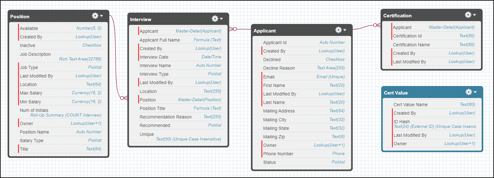

# Hiring Manager Org #

This simple Org allows Hiring Managers to manage posted positions, applicants, and interviews. Additionally, it automatically keeps applicants' lists of certifications up-to-date. Applicant's certifications are automatically synced in batches from an external system once a week.

To accomplish this, it uses a combination of declarative automation tools and Apex classes. Because we do not have an actual external system to sync to, we fake a response from one using randomized data pulled from [this Programming Quotes API](https://programming-quotes-api.herokuapp.com/quotes).

## Custom Objects ##

Relevant objects and their relationships can be seen below:

## Pertinent Files ##

### Syncing Certifications ###

* [Certification Sync Class](force-app/main/default/classes/ProgrammerQuotes_RequestResponse.cls "ProgrammerQuotes_RequestResponse.cls")
* [Certification Sync Test Class](force-app/main/default/classes/PQ_RequestResponse_TEST.cls "PQ_RequestResponse_TEST.cls")
* [Callout Mock Response](force-app/main/default/classes/PQ_RequestResponseMock.cls "PQ_RequestResponseMock.cls")

### Faking our Callout Response ###

* [Response Faker Class](force-app/main/default/classes/CertValueResponseFaker.cls "CertValueResponseFaker.cls")
* [Response Faker Test Class](force-app/main/default/classes/CertValueResponseFaker_TEST.cls "CertValueResponseFaker_TEST.cls")

### Wrapper Class ###

* [CertDetails](force-app/main/default/classes/CertDetails.cls "CertDetails.cls")